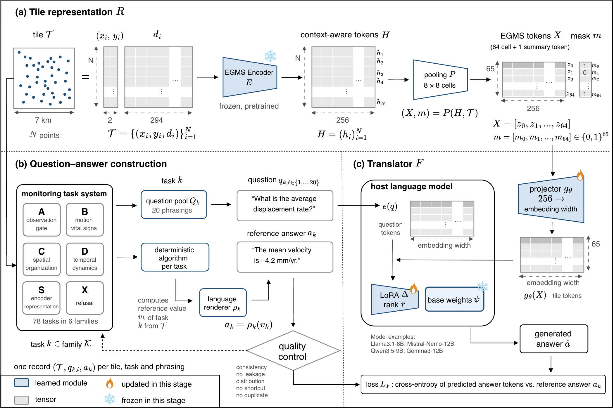

```text
 _____ _____ ___  ___ _____        _____  ___
|  ___|  __ \|  \/  |/  ___|      |  _  |/ _ \
| |__ | |  \/| .  . |\ `--. ______| | | / /_\ \
|  __|| | __ | |\/| | `--. \______| | | |  _  |
| |___| |_\ \| |  | |/\__/ /      \ \/' / | | |
\____/ \____/\_|  |_/\____/        \_/\_\_| |_/
```

# EGMS-QA

*[English](README.md) · [中文](README.zh-CN.md)*

[](LICENSE)
[](DATA_LICENSE)
[](pyproject.toml)
[](https://huggingface.co/collections/risenyard/egms-qa)

Natural-language question answering over persistent-scatterer displacement time
series, for the [European Ground Motion Service](https://egms.land.copernicus.eu/)
(EGMS).

EGMS-QA reads each 7 km tile of EGMS point histories, represents it as a fixed
set of tokens, and lets a host language model answer monitoring questions in
plain language — with calibrated refusal for out-of-scope questions.

```
tile (variable # points, 294-step histories)
   → frozen EGMS encoder + 8×8 pooling → 65 × 256 tokens
   → 2-layer projector → prefix ; "Question: …\nAnswer:" → frozen host LLM + LoRA → answer
```



## The three blocks

Each block pairs a code module here with its released artifacts on 🤗 Hugging Face:

| block | code (this repo) | what it is | artifacts (🤗) |
|---|---|---|---|
| **encoder** | [`src/egms_encoder/`](src/egms_encoder/) | the frozen tile representation and token extraction | [`egms-qa-encoder`](https://huggingface.co/risenyard/egms-qa-encoder) — checkpoint |
| **qa_construction** | [`src/egms_qa/qa_construction/`](src/egms_qa/qa_construction/) | the 78-task definitions and the question–answer records | [`egms-qa-dataset`](https://huggingface.co/datasets/risenyard/egms-qa-dataset) — QA, NPZ source tiles, tokens + tables |
| **translator** | [`src/egms_qa/translator/`](src/egms_qa/translator/) | projector + LoRA training and evaluation on host LLMs | [`egms-qa-translator`](https://huggingface.co/risenyard/egms-qa-translator) — 4 adapters |

Each block has its own README. The task system (78 tasks, families A/B/C/D/S/X)
and the dataset datasheet are documented in
[`src/egms_qa/qa_construction/README.md`](src/egms_qa/qa_construction/README.md).

## Results (held-out test)

The frozen encoder reconstructs masked intervals at 1.510 mm RMSE, near the
source residual noise. Across four host models (Qwen, Gemma, Llama, Mistral)
trained with the identical recipe, the adapted system reaches mean R² up to
0.778 on numeric tasks and balanced accuracy up to 0.777 on categorical tasks,
refuses out-of-scope questions at near-ceiling rates, and collapses toward chance
under a shuffled-token control — so the answers depend on the supplied tile.
Regenerate the full table with `python -m egms_qa.translator.summarize_results`.

## Install

```bash
pip install -e .                 # core (representation + QA rendering)
pip install -e ".[translator]"   # + host-LLM training / evaluation
pip install -e ".[tasks]"        # + task reference-value computation
```

Requires Python ≥ 3.10. GPU is needed for encoder token extraction and
translator training/evaluation.

## Data

Code lives here; the heavy artifacts are released on Hugging Face. The dataset
uses a publication-oriented layout and is linked into the runtime paths by
`egms_qa.release`; model repos download directly into their target directories:

- **Encoder** — frozen checkpoint + normalization: [`risenyard/egms-qa-encoder`](https://huggingface.co/risenyard/egms-qa-encoder) → into `data/encoder/checkpoint/`
- **Dataset** — QA, processed NPZ source tiles, encoder-token cache, labels, reference tables, and integrity metadata: [`risenyard/egms-qa-dataset`](https://huggingface.co/datasets/risenyard/egms-qa-dataset)
- **Translators** — 4 LoRA adapters + projectors, one dir per host model: [`risenyard/egms-qa-translator`](https://huggingface.co/risenyard/egms-qa-translator) → into `outputs/runs/` (→ `<key>/best/`)

```bash
# download, audit, and link the structured dataset release into this checkout
hf download risenyard/egms-qa-dataset \
    --repo-type dataset --local-dir release/egms-qa-dataset
python -m egms_qa.release audit --release-dir release/egms-qa-dataset
python -m egms_qa.release install \
    --release-dir release/egms-qa-dataset --target-root .
# encoder checkpoint (flat repo) — fetch into the path the code expects
hf download risenyard/egms-qa-encoder --local-dir data/encoder/checkpoint
# translators (flat repo, one dir per host model) — fetch into outputs/runs
hf download risenyard/egms-qa-translator --local-dir outputs/runs
```

Run reproduction commands from the checkout root so the relative tile paths in the
split manifest resolve. Paths are overridable via `EGMS_QA_ROOT`, `EGMS_QA_DATA`,
`EGMS_QA_OUTPUTS` (see [`src/egms_qa/paths.py`](src/egms_qa/paths.py)).
The NPZ source tiles are a modified/repacked derivative of the EGMS Level-3
Ortho Vertical product (© European Union, Copernicus Land Monitoring Service /
EEA), distributed with source and modification notices; see
the [dataset provenance](https://huggingface.co/datasets/risenyard/egms-qa-dataset/blob/main/metadata/SOURCE_PROVENANCE.md).
They are not an official EGMS product.

The `data/` and `outputs/` runtime paths are created locally by the release
installer and model downloads. No release data or checkpoint metadata is
tracked in this Git repository; Hugging Face is the single source of truth.

## Reproduce

```bash
# 0. (optional) retrain the frozen encoder from the installed NPZ tile store
python -m egms_encoder.pretrain --output-dir outputs/encoder_pretrain

# 1. tokens: either use the downloaded cache, or extract from the tile store
python -m egms_encoder.extract_tokens --output-dir outputs/tokens

# 2. task labels + QA records (or download them)
python -m egms_qa.qa_construction.build_labels
python -m egms_qa.qa_construction.generate_qa --out-dir outputs/qa

# 3. train and evaluate a host model
python -m egms_qa.translator.train --host-model Qwen/Qwen3.5-9B \
    --token-cache data/encoder/tokens/encoder_tokens_10k.pt --output-dir outputs/runs/qwen
python -m egms_qa.translator.evaluate --adapter-dir outputs/runs/qwen/best --split test

# 4. combined four-model report
python -m egms_qa.translator.summarize_results
```

`pytest` runs the answer-extractor tests.

## Licence

Code is released under the MIT Licence ([`LICENSE`](LICENSE)). EGMS-QA-created
data and model artifacts are CC-BY-4.0; Copernicus-derived source measurements
retain the CLMS terms documented in [`DATA_LICENSE`](DATA_LICENSE).
