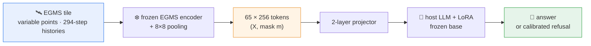

```text
 _____ _____ ___  ___ _____        _____  ___
|  ___|  __ \|  \/  |/  ___|      |  _  |/ _ \
| |__ | |  \/| .  . |\ `--. ______| | | / /_\ \
|  __|| | __ | |\/| | `--. \______| | | |  _  |
| |___| |_\ \| |  | |/\__/ /      \ \/' / | | |
\____/ \____/\_|  |_/\____/        \_/\_\_| |_/
```

<div align="center">

# EGMS-QA

### Natural-language question answering over InSAR ground-motion time series

*Ask any 7 km tile of the [European Ground Motion Service](https://egms.land.copernicus.eu/) a plain-language question — get a calibrated answer, or an honest refusal.*

[English](README.md) · [中文](README.zh-CN.md)

[](LICENSE)
[](DATA_LICENSE)
[](pyproject.toml)
[](https://huggingface.co/risenyard/egms-qa-dataset)
[](https://github.com/risenyard/egms-qa/stargazers)

**🤗 [Dataset](https://huggingface.co/datasets/risenyard/egms-qa-dataset) · [Encoder](https://huggingface.co/risenyard/egms-qa-encoder) · [Translator](https://huggingface.co/risenyard/egms-qa-translator)**

</div>

---

EGMS-QA reads each 7 km tile of EGMS point histories, represents it as a fixed
set of tokens, and lets a host language model answer monitoring questions in
plain language — with calibrated refusal for out-of-scope questions.



## The three blocks

Each block pairs a code module here with its released artifacts on 🤗 Hugging Face:

| block | code (this repo) | what it is | artifacts (🤗) |
|---|---|---|---|
| **encoder** | [`src/egms_encoder/`](src/egms_encoder/) | the frozen tile representation and token extraction | [`egms-qa-encoder`](https://huggingface.co/risenyard/egms-qa-encoder) — checkpoint + token cache |
| **qa_construction** | [`src/egms_qa/qa_construction/`](src/egms_qa/qa_construction/) | the 78-task definitions and the question–answer records | [`egms-qa-dataset`](https://huggingface.co/datasets/risenyard/egms-qa-dataset) — QA records + tables |
| **translator** | [`src/egms_qa/translator/`](src/egms_qa/translator/) | projector + LoRA training and evaluation on host LLMs | [`egms-qa-translator`](https://huggingface.co/risenyard/egms-qa-translator) — 4 adapters |

Each block has its own README. The task system (78 tasks, families A/B/C/D/S/X)
and the dataset datasheet are documented in
[`src/egms_qa/qa_construction/README.md`](src/egms_qa/qa_construction/README.md).

## Results (held-out test)

The frozen encoder reconstructs masked intervals at 1.510 mm RMSE, near the
source residual noise. Across four host models (Qwen, Gemma, Llama, Mistral)
trained with the identical recipe, the adapted system reaches mean R² up to
0.778 on numeric tasks and balanced accuracy up to 0.777 on categorical tasks,
refuses out-of-scope questions at near-ceiling rates, and collapses toward chance
under a shuffled-token control — so the answers depend on the supplied tile.
Regenerate the full table with `python -m egms_qa.translator.summarize_results`.

## Install

```bash
pip install -e .                 # core (representation + QA rendering)
pip install -e ".[translator]"   # + host-LLM training / evaluation
pip install -e ".[tasks]"        # + task reference-value computation
```

Requires Python ≥ 3.10. GPU is needed for encoder token extraction and
translator training/evaluation.

## Data

Code lives here; the heavy artifacts are released on Hugging Face:

- **Encoder** — checkpoint + 10k-tile token cache: [`risenyard/egms-qa-encoder`](https://huggingface.co/risenyard/egms-qa-encoder)
- **Dataset** — QA records, labels, per-family reference tables: [`risenyard/egms-qa-dataset`](https://huggingface.co/datasets/risenyard/egms-qa-dataset)
- **Translators** — 4 LoRA adapters + projectors: [`risenyard/egms-qa-translator`](https://huggingface.co/risenyard/egms-qa-translator)

Place the downloaded files into a checkout as:

```
data/encoder/checkpoint/encoder.pt         # from egms-qa-encoder
data/encoder/tokens/encoder_tokens_10k.pt  # from egms-qa-encoder
outputs/qa/…            # labels + QA jsonl              (from egms-qa-dataset)
outputs/tasks/…         # per-family reference tables    (from egms-qa-dataset)
outputs/runs/<key>/best/   # adapters qwen|gemma|llama|mistral (from egms-qa-translator)
```

Paths are overridable via `EGMS_QA_ROOT`, `EGMS_QA_DATA`, `EGMS_QA_OUTPUTS`,
`EGMS_ENCODER_HOME` (see [`src/egms_qa/paths.py`](src/egms_qa/paths.py)). The raw
EGMS Level-3 product is Copernicus data and is not redistributed; see
[`data/METADATA.md`](data/METADATA.md).

## Reproduce

```bash
# 1. tokens: either download the cache, or extract from the raw tile store
python -m egms_encoder.extract_tokens --output-dir outputs/tokens

# 2. task labels + QA records (or download them)
python -m egms_qa.qa_construction.build_probe_labels
python -m egms_qa.qa_construction.generate_qa --out-dir outputs/qa

# 3. train and evaluate a host model
python -m egms_qa.translator.train --qwen-path Qwen/Qwen3.5-9B \
    --token-cache data/encoder/tokens/encoder_tokens_10k.pt --output-dir outputs/runs/qwen
python -m egms_qa.translator.evaluate --adapter-dir outputs/runs/qwen/best --split test

# 4. combined four-model report
python -m egms_qa.translator.summarize_results
```

`pytest` runs the answer-extractor tests.

## Licence

Code is released under the MIT Licence ([`LICENSE`](LICENSE)); the dataset and
model weights under CC-BY-4.0 ([`DATA_LICENSE`](DATA_LICENSE)).
