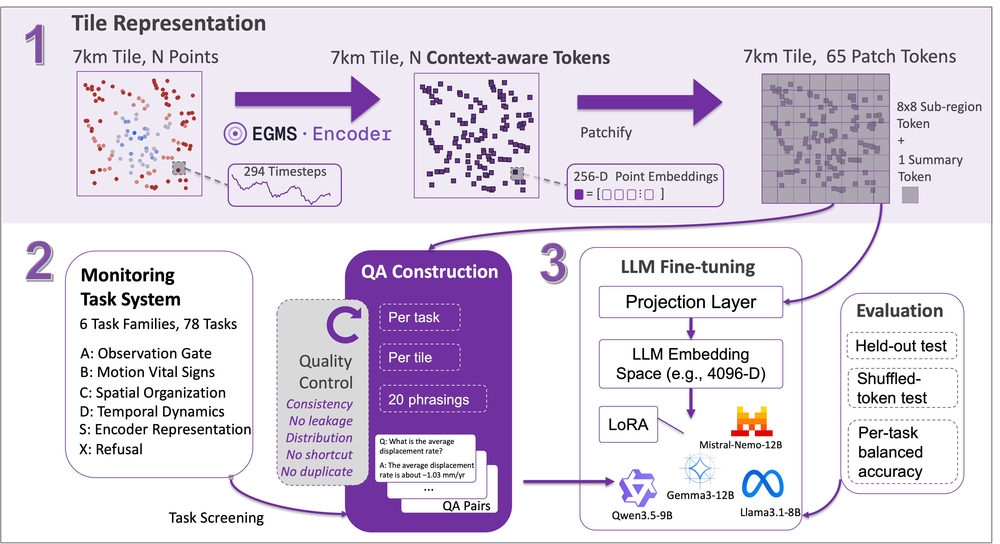

```text
 _____ _____ ___  ___ _____        _____  ___
|  ___|  __ \|  \/  |/  ___|      |  _  |/ _ \
| |__ | |  \/| .  . |\ `--. ______| | | / /_\ \
|  __|| | __ | |\/| | `--. \______| | | |  _  |
| |___| |_\ \| |  | |/\__/ /      \ \/' / | | |
\____/ \____/\_|  |_/\____/        \_/\_\_| |_/
```

# EGMS-QA

*[English](README.md) · [中文](README.zh-CN.md)*

[](LICENSE)
[](DATA_LICENSE)
[](pyproject.toml)
[](https://huggingface.co/risenyard)

面向[欧洲地面运动服务](https://egms.land.copernicus.eu/)(EGMS)的持久散射体形变
时间序列自然语言问答系统。

EGMS-QA 读取每个 7 km 瓦片(tile)内的 EGMS 点位时间序列,将其编码为一组固定长度的
token,再由一个宿主语言模型用自然语言回答监测类问题,并对超出范围的问题给出经过校准
的拒答。

```
瓦片(点数可变,294 步历史)
   → 冻结的 EGMS 编码器 + 8×8 池化 → 65 × 256 token
   → 两层投影器 → 前缀 ; "Question: …\nAnswer:" → 冻结宿主 LLM + LoRA → 答案
```



## 三个模块

每一块都由本仓库的代码模块与其在 🤗 Hugging Face 上发布的产物配对:

| 模块 | 代码(本仓库) | 内容 | 产物(🤗) |
|---|---|---|---|
| **encoder** | [`src/egms_encoder/`](src/egms_encoder/) | 冻结的瓦片表示与 token 提取 | [`egms-qa-encoder`](https://huggingface.co/risenyard/egms-qa-encoder) — checkpoint |
| **qa_construction** | [`src/egms_qa/qa_construction/`](src/egms_qa/qa_construction/) | 78 个任务的定义与问答对记录 | [`egms-qa-dataset`](https://huggingface.co/datasets/risenyard/egms-qa-dataset) — QA、NPZ 源瓦片、tokens + 参考值表 |
| **translator** | [`src/egms_qa/translator/`](src/egms_qa/translator/) | 投影器 + LoRA 在宿主 LLM 上的训练与评测 | [`egms-qa-translator`](https://huggingface.co/risenyard/egms-qa-translator) — 4 个 adapter |

每个模块都有各自的 README。任务体系(78 个任务,A/B/C/D/S/X 六族)与数据集
datasheet 记录在 [`src/egms_qa/qa_construction/README.md`](src/egms_qa/qa_construction/README.md)。

## 结果(留出测试集)

冻结编码器对被掩盖区间的重建 RMSE 为 1.510 mm,接近源产品的残差噪声。四个宿主模型
(Qwen、Gemma、Llama、Mistral)以相同配方训练后,数值任务平均 R² 最高达 0.778,
分类任务平衡准确率最高达 0.777,对超范围问题接近满分拒答;在打乱 token 的对照下退化
到接近随机——说明答案确实依赖于所给瓦片。用
`python -m egms_qa.translator.summarize_results` 可重新生成完整结果表。

## 安装

```bash
pip install -e .                 # 核心(表示 + QA 渲染)
pip install -e ".[translator]"   # + 宿主 LLM 训练/评测
pip install -e ".[tasks]"        # + 任务参考值计算
```

需要 Python ≥ 3.10。编码器 token 提取与翻译器训练/评测需要 GPU。

## 数据

代码在本仓库;重数据发布在 Hugging Face。dataset 采用面向发布的分层结构,由
`egms_qa.release` 映射到运行路径;encoder 与 translator 模型库下载到目标目录即可:

- **编码器** —— 冻结 checkpoint + 归一化参数:[`risenyard/egms-qa-encoder`](https://huggingface.co/risenyard/egms-qa-encoder) → 下载进 `data/encoder/checkpoint/`
- **数据集** —— QA、处理后的 NPZ 源瓦片、encoder token、标签、参考值表与完整性元数据:[`risenyard/egms-qa-dataset`](https://huggingface.co/datasets/risenyard/egms-qa-dataset)
- **翻译器** —— 4 个 LoRA adapter + projector,每个宿主模型一个目录:[`risenyard/egms-qa-translator`](https://huggingface.co/risenyard/egms-qa-translator) → 下载进 `outputs/runs/`(→ `<key>/best/`)

```bash
# 下载、审计并把专业发布结构链接到本 checkout 的运行路径
hf download risenyard/egms-qa-dataset \
    --repo-type dataset --local-dir release/egms-qa-dataset
python -m egms_qa.release audit --release-dir release/egms-qa-dataset
python -m egms_qa.release install \
    --release-dir release/egms-qa-dataset --target-root .
# 编码器 checkpoint(扁平库)—— 拉进代码期望的路径
hf download risenyard/egms-qa-encoder --local-dir data/encoder/checkpoint
# 翻译器(扁平库,每个宿主模型一个目录)—— 拉进 outputs/runs
hf download risenyard/egms-qa-translator --local-dir outputs/runs
```

复现命令请**从 checkout 根目录运行**,这样 split manifest 里的相对瓦片路径才能解析。
路径均可通过 `EGMS_QA_ROOT`、`EGMS_QA_DATA`、`EGMS_QA_OUTPUTS`
覆盖(见 [`src/egms_qa/paths.py`](src/egms_qa/paths.py))。NPZ 源瓦片是 EGMS Level-3
Ortho Vertical 产品的修改与重打包衍生物(© European Union, Copernicus / EEA),附带
来源和修改说明;它们不是 EGMS 官方产品。见 [`data/METADATA.md`](data/METADATA.md)。

## 复现

```bash
# 0.(可选)从安装好的 NPZ tile store 重训冻结编码器
python -m egms_encoder.pretrain --output-dir outputs/encoder_pretrain

# 1. token:使用下载缓存,或从 NPZ tile store 提取
python -m egms_encoder.extract_tokens --output-dir outputs/tokens

# 2. 任务标签 + QA 记录(或直接下载)
python -m egms_qa.qa_construction.build_labels
python -m egms_qa.qa_construction.generate_qa --out-dir outputs/qa

# 3. 训练并评测一个宿主模型
python -m egms_qa.translator.train --host-model Qwen/Qwen3.5-9B \
    --token-cache data/encoder/tokens/encoder_tokens_10k.pt --output-dir outputs/runs/qwen
python -m egms_qa.translator.evaluate --adapter-dir outputs/runs/qwen/best --split test

# 4. 四模型汇总报告
python -m egms_qa.translator.summarize_results
```

`pytest` 运行答案提取器的测试。

## 许可

代码以 MIT 许可发布([`LICENSE`](LICENSE));EGMS-QA 创建的数据和模型产物以
CC-BY-4.0 发布。Copernicus 衍生源测量遵循 [`DATA_LICENSE`](DATA_LICENSE) 中列出的
CLMS 条款。
