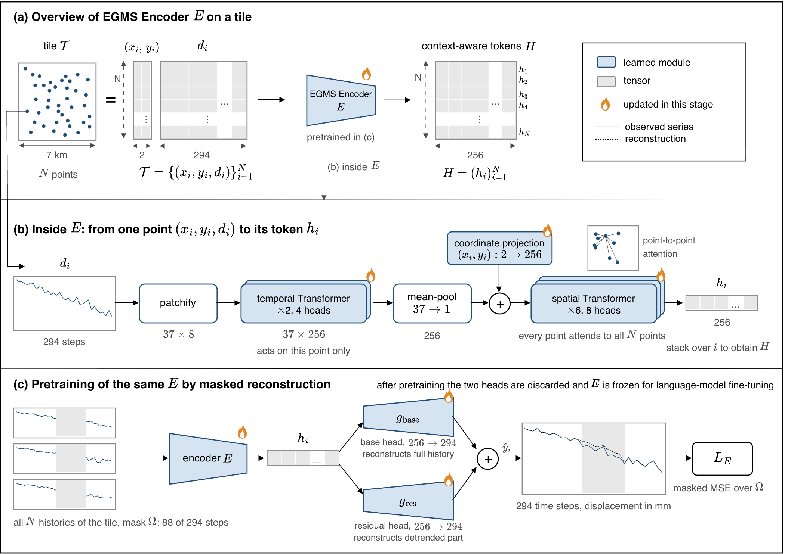

# EGMS-QA Encoder

The encoder takes a variable number of persistent-scatterer displacement
histories and their coordinates from each 7 km tile. It first produces a
256-dimensional contextual representation for every point, then pools those
representations into 65 tile tokens: one summary token and 64 spatial-cell
tokens, each with 256 dimensions.

## Architecture



Each normalized history is divided into temporal patches. A temporal
Transformer and mean pooling form a 256-dimensional representation for each
point. A coordinate embedding is added before spatial attention exchanges
information across points. Pretraining reconstructs a synchronized masked
interval shared by all points in a tile. Token extraction runs the frozen
encoder without masking and pools the point features into an 8×8 grid.

## Workflows

This guide covers installation, token extraction, and training for
[EGMS-QA](../../README.md). The
[Hugging Face model card](https://huggingface.co/risenyard/egms-qa-encoder)
documents the released files, input requirements, and evaluation results.
The [Dataset repository](https://huggingface.co/datasets/risenyard/egms-qa-dataset)
provides the prepared tiles and precomputed tokens.

| goal | where to start |
|---|---|
| Try the released encoder | [Install the code](#installation), then [extract tokens](#extract-tokens) |
| Train an encoder | [Reproduce training](#reproduce-training) |
| Use your own tiles or checkpoint | [Use local inputs](#use-local-inputs) |
| Inspect the released model | Hugging Face [files](https://huggingface.co/risenyard/egms-qa-encoder#files) and [evaluation](https://huggingface.co/risenyard/egms-qa-encoder#evaluation) |

## Installation

Python 3.10 or later is required. Clone and install the code once, then run all
commands below from the `egms-qa` repository root.

```bash
git clone https://github.com/risenyard/egms-qa
cd egms-qa
pip install -e .
```

## Extract tokens

Start with one tile. The command retrieves the released encoder from its
Hugging Face model repository and the tile from the Dataset repository.

```bash
python -m egms_encoder.extract_tokens \
    --encoder-repo risenyard/egms-qa-encoder \
    --dataset-repo risenyard/egms-qa-dataset \
    --max-tiles 1 \
    --output-dir outputs/tokens
```

The output is `outputs/tokens/egms_tokens_1.pt`, with token shape `[1,65,256]`,
validity masks, and the tile identifier. The accompanying metadata records the
model and Dataset revisions. Add `--device cpu` for a CPU run.

Remove `--max-tiles 1` to process all 10,000 tiles and write
`outputs/tokens/egms_tokens_10k.pt` with shape `[10000,65,256]`. GPU execution
is recommended for the full dataset.

For question answering with the precomputed tokens, follow the
[Translator guide](../egms_qa/translator/README.md). Its setup installs the
released tokens together with the QA labels and task tables.

## Use local inputs

The released workflows use prepared EGMS-QA NPZ tiles. For a new collection,
check the [model's input requirements](https://huggingface.co/risenyard/egms-qa-encoder#input-requirements)
before using the local-input options below. The extractor normalizes
displacement values and centers coordinates within each tile.

After [installing the code](#installation), provide `--manifest` and
`--data-config` together. The manifest needs `tile_id`, `split`, and `path`;
missing `n_points`, `centroid_x`, and `centroid_y` columns are derived from
the NPZ coordinates. Use `--source-tiles-root` to resolve relative tile
paths against a different directory. Encoder inference uses displacement histories and coordinates.
For example, a manifest path `tile_01.npz` with `--source-tiles-root my_tiles`
reads `my_tiles/tile_01.npz`. Absolute manifest paths remain absolute.

For a local checkpoint, provide `--checkpoint`, `--model-config`, and
`--normalization` together. The [training guide](#reproduce-training) shows how to extract tokens with
a checkpoint produced by training.

## Reproduce training

Complete the [installation](#installation) first. From the repository root,
download the Dataset and the model settings from Hugging Face, then start
training:

```bash
python -m egms_qa.release install --download --components tiles
hf download risenyard/egms-qa-encoder --include '*.json' \
    --local-dir data/encoder/checkpoint
python -m egms_encoder.pretrain \
    --output-dir outputs/my_encoder --device cuda:0
```

Training reads the architecture, recipe, and normalization from
`data/encoder/checkpoint/`. It starts from scratch with the released
train-fitted normalization. Command-line overrides support custom experiments.

The output directory contains `best.safetensors` for inference, `latest.pt`
for resuming training, and the corresponding `config.json`,
`training_args.json`, and `normalization.json`. Resume with those files:

```bash
python -m egms_encoder.pretrain \
    --model-config outputs/my_encoder/config.json \
    --training-args outputs/my_encoder/training_args.json \
    --normalization outputs/my_encoder/normalization.json \
    --resume-from outputs/my_encoder/latest.pt \
    --output-dir outputs/my_encoder --device cuda:0
```

To extract tokens with the trained encoder, pass its inference bundle and the
installed data contract:

```bash
python -m egms_encoder.extract_tokens \
    --checkpoint outputs/my_encoder/best.safetensors \
    --model-config outputs/my_encoder/config.json \
    --normalization outputs/my_encoder/normalization.json \
    --manifest data/encoder/manifest/split.parquet \
    --data-config data/encoder/manifest/data_config.json \
    --output-dir outputs/my_tokens --device cuda:0
```

## Code reference

| module | purpose |
|---|---|
| `models/tile_encoder.py` | temporal and spatial encoder |
| `data/tile_store.py` | NPZ loading and stored-window validation |
| `checkpoint.py` | model configuration and weight loading |
| `extract_tokens.py` | encoding and spatial pooling |
| `pretrain.py` | masked-reconstruction training |

## Scope

Official EGMS downloads and conversion to the required NPZ tiles need a
separate data-preparation workflow. The
[model card](https://huggingface.co/risenyard/egms-qa-encoder#scope-and-license)
describes the encoder's application limits and model license.
