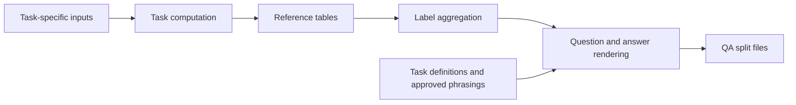

# EGMS-QA Construction

This module builds task reference values, aggregates labels, and renders
natural-language question–answer records. The released tables and labels can
also be used as starting points for new QA corpora.

## Architecture



Task scripts use prepared tiles, encoder artifacts, or other scientific inputs
specified by their methods. Label aggregation joins the reference tables by
tile ID and split. Rendering combines those targets with approved question
phrasings and answer templates. The [task index](tasks/README.md) identifies
the inputs and implementation for each group.

## Workflows

This guide covers construction commands and the task catalog for
[EGMS-QA](../../../README.md). The
[Hugging Face Dataset card](https://huggingface.co/datasets/risenyard/egms-qa-dataset)
documents the released records, fields, file layout, and scientific provenance.

| goal | where to start |
|---|---|
| Read the published QA records | [HF QA use](https://huggingface.co/datasets/risenyard/egms-qa-dataset#qa-use) |
| Use released artifacts in this codebase | [Install the code](#installation), then [install the Dataset](#use-the-released-records) |
| Render a new QA corpus | [Generate question–answer records](#generate-questionanswer-records) |
| Rebuild labels or reference values | [Construction workflow](#construction-workflow) and [task index](tasks/README.md) |
| Find a task definition | [Task catalog](#task-catalog) |

## Installation

Python 3.10 or later is required. Clone and install the code, then run all
commands below from the `egms-qa` repository root.

```bash
git clone https://github.com/risenyard/egms-qa
cd egms-qa
pip install -e .
```

Label aggregation and QA rendering can run on CPU. Task-specific computation
may require additional dependencies or GPU execution, as described in the
linked methods.

## Use the released records

After [installing the code](#installation), download and install the Dataset:

```bash
hf download risenyard/egms-qa-dataset --repo-type dataset \
    --local-dir release/egms-qa-dataset
python -m egms_qa.release install \
    --release-dir release/egms-qa-dataset --target-root .
```

This downloads the full release, including source tiles and encoder tokens.
The installer checks its inventory, then links the artifacts into the runtime
paths expected by the code. It refuses to overwrite an existing target.

| HF source | installed local path |
|---|---|
| [Source tiles](https://huggingface.co/datasets/risenyard/egms-qa-dataset/tree/main/artifacts/source_tiles) | `data/tiles/` |
| [split_manifest.parquet](https://huggingface.co/datasets/risenyard/egms-qa-dataset/blob/main/metadata/split_manifest.parquet) | `data/encoder/manifest/split.parquet` |
| [data_config.json](https://huggingface.co/datasets/risenyard/egms-qa-dataset/blob/main/metadata/data_config.json) | `data/encoder/manifest/data_config.json` |
| [Encoder tokens](https://huggingface.co/datasets/risenyard/egms-qa-dataset/tree/main/artifacts/representations) | `data/encoder/tokens/` |
| [Reference tables](https://huggingface.co/datasets/risenyard/egms-qa-dataset/tree/main/artifacts/reference_tables) | `outputs/tasks/` |
| [labels.parquet](https://huggingface.co/datasets/risenyard/egms-qa-dataset/blob/main/artifacts/labels/labels.parquet) | `outputs/qa/labels.parquet` |
| [Labels metadata](https://huggingface.co/datasets/risenyard/egms-qa-dataset/blob/main/artifacts/labels/metadata.json) | `outputs/qa/labels_meta.json` |
| [train.jsonl](https://huggingface.co/datasets/risenyard/egms-qa-dataset/blob/main/data/qa/train.jsonl) | `outputs/qa/v1_train.jsonl` |
| [validation.jsonl](https://huggingface.co/datasets/risenyard/egms-qa-dataset/blob/main/data/qa/validation.jsonl) | `outputs/qa/v1_val.jsonl` |
| [test.jsonl](https://huggingface.co/datasets/risenyard/egms-qa-dataset/blob/main/data/qa/test.jsonl) | `outputs/qa/v1_test.jsonl` |
| [QA audit](https://huggingface.co/datasets/risenyard/egms-qa-dataset/blob/main/metadata/qa_audit.json) | `outputs/qa/qa_audit.json` |

To verify every file's SHA256, run:

```bash
python -m egms_qa.release audit \
    --release-dir release/egms-qa-dataset --verify-hashes
```

Use these installed records for the published
[Translator workflows](../translator/README.md).

## Generate question–answer records

Start with a small rendering run from the installed labels and approved phrasings:

```bash
python -m egms_qa.qa_construction.generate_qa \
    --out-dir outputs/qa-generated \
    --max-tiles 2 --train-cycles 1
```

The command writes `v1_train_e00.jsonl`, `v1_val.jsonl`, and `v1_test.jsonl`
under `outputs/qa-generated/qa/`. Record counts and rendering metadata appear
in the parent directory.

Remove `--max-tiles 2 --train-cycles 1` to render the full installed corpus
with the default two training phrasing cycles. This also writes
`v1_train_e01.jsonl`. Each token-dependent tile–task pair receives one phrasing
per cycle from a pool of 20. Refusal tasks use a capped sample of tiles per task.

These commands create new corpora in a separate output directory. Use the
Dataset's fixed `data/qa/{train,validation,test}.jsonl` files when reproducing
the published model results. Matching record counts alone does not establish
byte-for-byte reproduction of those files.

## Construction workflow

| step | implementation | output |
|---|---|---|
| Task reference values | group scripts and algorithm notes in `tasks/` | one reference table per task group |
| Label aggregation | `build_labels.py`, `task_specs.py`, and `tables.py` | `labels.parquet` and `labels_meta.json` |
| Question and answer rendering | `generate_qa.py` and `qa_lib.py` | split JSONL files and rendering metadata |

The [task implementation index](tasks/README.md) links all 27 task groups and
their dependencies. To rebuild labels from the installed reference tables and
render them into a new directory:

```bash
python -m egms_qa.qa_construction.build_labels \
    --out-dir outputs/labels-generated
python -m egms_qa.qa_construction.generate_qa \
    --labels outputs/labels-generated/labels.parquet \
    --meta outputs/labels-generated/labels_meta.json \
    --out-dir outputs/qa-generated
```

The label builder checks table identities and splits against the published
encoder token cache, then aligns label rows to its tile order. The released
label file supplies the targets for the published QA records. The
optional [temporal summary](temporal_summary.md) combines D1–D4 tables for analysis.

## Recompute D1, D4, and S3

With the Dataset installed, D1 fits temporal geometry from the NPZ tiles and
data configuration. Its curvature and changepoint thresholds are fitted on
the training split. S3 uses D1 curvature and changepoint strength alongside
the other A/B/C/D monitoring indicators. D4 uses D1 trend shape to distinguish
the trend-dominated evolution archetypes.

```bash
pip install -e '.[tasks]'
python -m egms_qa.qa_construction.tasks.d1.d1_compute \
    --out-dir outputs/tasks-rebuilt/d1 --workers 8
python -m egms_qa.qa_construction.tasks.d4.d4_compute \
    --d1-table outputs/tasks-rebuilt/d1/d1_final_table.csv \
    --out-dir outputs/tasks-rebuilt/d4
python -m egms_qa.qa_construction.tasks.s3.s3_compute \
    --d1-table outputs/tasks-rebuilt/d1/d1_final_table.csv \
    --out-dir outputs/tasks-rebuilt/s3
```

These commands write outputs separately from the installed tables. The
[D1 method](tasks/d1/d1_algorithm.md), [D4 method](tasks/d4/d4_algorithm.md),
and [S3 method](tasks/s3/s3_algorithm.md) describe their inputs and formulas.
D4 and S3 both use the D1 file passed in the commands above.

The label-generation examples above use the canonical released tables.
Consult the task index for other groups' dependencies and reconstruction scope.

## Dataset contract

The [Dataset card](https://huggingface.co/datasets/risenyard/egms-qa-dataset)
is the reference for QA fields, split sizes, source-tile arrays, normalization,
and supporting scientific inputs. Its
[source provenance](https://huggingface.co/datasets/risenyard/egms-qa-dataset/blob/main/SOURCE_PROVENANCE.md)
documents the EGMS product and the relationship between stored and source time indices.

## Task catalog

The catalog contains 78 tasks in 27 task groups under six families
(A/B/C/D/S/X). Families A–D and S contain 64 token-dependent tasks with numeric
or categorical targets. Family X contains
14 refusal tasks for questions outside the supported scope. Numeric targets
describe quantities, categorical targets assign classes, and refusal targets
state the evidence boundary.

| family | task groups | leaf tasks | focus |
|---|---:|---:|---|
| A | 5 | 10 | Observation quality and usability |
| B | 6 | 14 | Motion magnitude, direction, and typicality |
| C | 5 | 12 | Spatial organization and monitoring context |
| D | 4 | 15 | Temporal trend, seasonality, and intensification |
| S | 4 | 13 | Properties of the encoder representation |
| X | 3 | 14 | Boundaries of supported questions |

The tables use `num` for numeric targets and `cat` for categorical targets.
The translator's reported evaluation uses a defined 71-task subset of this
catalog. The [evaluation protocol](../translator/README.md#evaluation-protocol)
describes its three answer types and links to the exact configuration.

### A: observation gate (10)
Record quality and representation reliability.

| Task | Type | Description | Task | Type | Description |
|---|---|---|---|---|---|
| A11 | num | global representation drift | A12 | cat | representation stability class |
| A21 | num | masked reconstruction loss | A22 | cat | reconstruction reliability class |
| A31 | num | spatial observation coverage | A32 | cat | spatial coverage class |
| A41 | num | median measurement noise | A42 | cat | measurement noise class |
| A51 | cat | monitoring usability gate | A52 | cat | monitoring usability reason |

### B: motion vital signs (14)
Strength and character of the observed motion.

| Task | Type | Description | Task | Type | Description |
|---|---|---|---|---|---|
| B11 | num | average subsidence SNR | B12 | cat | clear subsidence signal |
| B21 | num | mean velocity | B22 | cat | mean subsidence intensity band |
| B31 | num | sinking-tail velocity | B32 | num | upper-tail velocity |
| B33 | num | absolute tail velocity | B34 | cat | uplift-protected direction |
| B35 | cat | worst-point significance | B36 | cat | European velocity typicality |
| B41 | num | acceleration strength | B42 | cat | European acceleration typicality |
| B51 | num | seasonality strength | B61 | cat | monitoring trigger |

### C: spatial organization (12)
The spatial distribution of motion within the tile.

| Task | Type | Description | Task | Type | Description |
|---|---|---|---|---|---|
| C11 | num | moving-point fraction | C12 | cat | motion extent class |
| C13 | cat | strongest-motion bin | C21 | num | spatial concentration |
| C22 | cat | concentration class | C31 | num | deformation-front strength |
| C32 | cat | front location | C33 | cat | front strength class |
| C41 | num | fast-tail bin fraction | C42 | cat | fast-tail extent class |
| C51 | cat | monitoring priority | C52 | cat | hidden local risk |

### D: temporal dynamics (15)
Changes in motion over the observation period.

| Task | Type | Description | Task | Type | Description |
|---|---|---|---|---|---|
| D11 | cat | trend shape | D12 | num | curvature strength |
| D13 | num | changepoint strength | D14 | num | strong-changepoint time |
| D21 | cat | dominant seasonal phase | D22 | num | seasonal phase coherence |
| D23 | num | seasonal phase dispersion | D24 | num | seasonal amplitude change |
| D31 | num | motion intensification | D32 | num | acceleration spatial support |
| D33 | num | intensification spread | D34 | num | hotspot strength |
| D35 | cat | hotspot location | D41 | cat | dominant process |
| D42 | cat | evolution archetype | | | |

### S: representation constructs (13)
Properties of the frozen encoder representation.

| Task | Type | Description | Task | Type | Description |
|---|---|---|---|---|---|
| S11 | cat | reference anchor profile | S12 | num | nearest anchor distance |
| S13 | num | anchor margin | S14 | cat | assignment status |
| S15 | cat | anchor profile description | S21 | num | local isolation score |
| S22 | cat | representation rarity class | S31 | num | representation–monitoring rarity gap |
| S32 | cat | rarity relation | S33 | cat | distinctive dimension |
| S41 | num | local structure strength | S42 | cat | local structure class |
| S43 | num | local structure concentration | | | |

### X: refusal boundary (14)
Questions that require a designated refusal.

| Tasks | Category |
|---|---|
| X11–X15 | unsupported inference (cause, forecast, safety, …) |
| X21–X26 | unavailable data or scale (exact assets, sub-cell points, other components, external context, live status, open rankings) |
| X31–X33 | representation boundary |

Each task-group directory contains its algorithm note, such as
[`tasks/d2/d2_algorithm.md`](tasks/d2/d2_algorithm.md). Refer to these notes for
task-specific inputs, reference-value definitions, and validity conditions.

## License and scope

Task targets describe observed displacement and representation properties.
Refusal tasks define the boundary of supported questions. Data provenance,
licensing, and application limits are documented in the
[Dataset card](https://huggingface.co/datasets/risenyard/egms-qa-dataset#provenance-terms-and-limitations)
and [DATA_LICENSE](../../../DATA_LICENSE).
